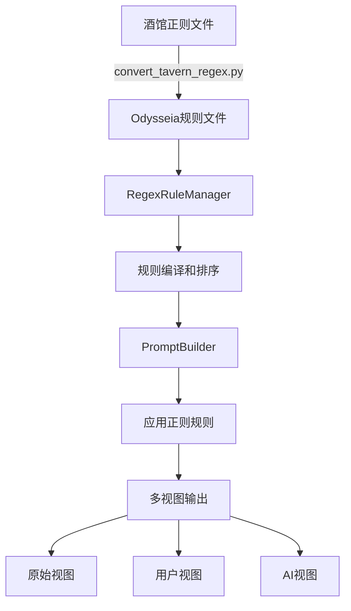

# 正则脚本系统运行逻辑分析报告

## 📋 概述

本报告全面分析了 SillyTavern Odysseia 项目中的正则表达式脚本系统，包括其运行逻辑、架构设计、功能验证和测试结果。

## 🏗️ 系统架构

### 核心组件

1. **RegexRule 数据模型** (`src/services/data_models.py`)
2. **RegexRuleManager 规则管理器** (`src/services/regex_rule_manager.py`)
3. **PromptBuilder 提示词构建器** (`src/services/prompt_builder.py`)
4. **酒馆正则转换脚本** (`scripts/convert_tavern_regex.py`)

### 数据流架构图



## 🔧 核心功能

### 1. 正则规则数据模型 (RegexRule)

**字段结构:**
```python
@dataclass
class RegexRule:
    id: str                    # 规则唯一标识符
    name: str                  # 规则名称
    enabled: bool = True       # 规则是否启用
    find_regex: str            # 查找的正则表达式
    replace_regex: str         # 替换的正则表达式
    targets: List[str]         # 作用对象 ["user", "assistant_response", "world_book", "preset", "assistant_thinking"]
    placement: str = "after_macro"  # 作用时机 ["before_macro_skip", "before_macro_include", "after_macro"]
    views: List[str]           # 作用效果 ["original", "user_view", "assistant_view"]
    min_depth: Optional[int]   # 生效的最小深度
    max_depth: Optional[int]   # 生效的最大深度
    min_order: Optional[int]   # 生效的最小次序
    max_order: Optional[int]   # 生效的最大次序
    description: str = ""      # 规则描述
    enabled_expression: Any = None  # 启用规则的条件表达式
```

### 2. 规则管理器 (RegexRuleManager)

**主要功能:**
- **规则加载**: 从JSON文件批量加载规则
- **规则编译**: 将正则表达式预编译为Pattern对象
- **规则排序**: 按targets数量和id排序
- **规则应用**: 根据内容类型、深度、次序等条件筛选和应用规则
- **统计信息**: 跟踪规则应用次数和匹配次数

**核心方法:**
- `load_rules()`: 加载规则文件
- `add_rule()`: 添加单个规则
- `apply_regex_to_content()`: 应用规则到内容
- `get_stats()`: 获取应用统计

### 3. 正则处理时机 (Placement)

正则规则在提示词构建过程中的三个应用时机：

1. **before_macro_skip**: 宏处理前应用，但跳过宏内部字符
   - 使用占位符替换宏→应用正则→恢复宏
   - 适用于需要处理宏周围内容但保持宏完整性的场景

2. **before_macro_include**: 宏处理前应用，包括宏内部字符  
   - 直接对包含宏的内容应用正则
   - 适用于需要修改宏本身的场景

3. **after_macro**: 宏处理后应用
   - 在宏展开后对最终内容应用正则
   - 适用于对处理结果进行后处理的场景

### 4. 多视图支持 (Views)

系统支持三种不同的视图，每种视图可以应用不同的正则规则：

1. **original**: 原始视图
   - 修改底层原始提示词数据
   - 影响所有后续处理

2. **user_view**: 用户视图  
   - 只在用户界面显示时生效
   - 用于隐藏敏感信息或美化显示

3. **assistant_view**: AI视图
   - 只在发送给AI模型时生效
   - 用于添加系统指令或特殊格式化

### 5. 深度和次序控制

规则可以通过深度 (depth) 和次序 (order) 来精确控制作用范围：

- **min_depth / max_depth**: 控制在聊天深度范围内生效
- **min_order / max_order**: 控制在消息次序范围内生效

## 🔄 酒馆正则转换

### 转换映射表

| 酒馆字段 | Odysseia字段 | 说明 |
|---------|-------------|------|
| scriptName | name | 规则名称 |
| findRegex | find_regex | 查找正则 |
| replaceString | replace_regex | 替换正则 (需转换$n为\n) |
| placement | targets | 数值映射为字符串数组 |
| disabled | enabled | 取反 |
| minDepth/maxDepth | min_depth/max_depth | 深度范围 |

### Placement 映射

| 酒馆数值 | Odysseia字符串 | 含义 |
|---------|---------------|------|
| 1 | "user" | 用户消息 |
| 2 | "assistant_response" | AI回复 |
| 5 | "world_book" | 世界书 |
| 6 | "assistant_thinking" | AI思考 |

### 替换模式转换

酒馆正则使用 `$1, $2` 格式，需要转换为Python正则的 `\1, \2` 格式：

```python
def convert_replace_pattern(replace_str: str) -> str:
    import re
    return re.sub(r'\$(\d+)', r'\\\1', replace_str)
```

## 🧪 测试验证

### 测试覆盖范围

1. **数据模型测试**: RegexRule字段验证和默认值测试
2. **基础功能测试**: 规则的增删查改、启用禁用
3. **正则应用测试**: 不同视图、不同placement类型的规则应用
4. **范围控制测试**: 深度和次序范围的精确控制
5. **边界条件测试**: 空内容、无效正则、重复ID等异常情况
6. **集成测试**: 与转换后的酒馆正则的完整集成
7. **转换测试**: 酒馆正则格式到Odysseia格式的转换验证

### 测试结果

**最终测试结果**: ✅ **30/30 测试通过 (100%)**

- 酒馆正则转换功能: 7/7 通过
- RegexRule数据模型: 2/2 通过  
- RegexRuleManager基础功能: 5/5 通过
- 正则应用功能: 5/5 通过
- placement类型测试: 3/3 通过
- 边界条件测试: 3/3 通过
- 酒馆正则集成测试: 1/1 通过

## 🔧 修复的问题

### 1. 转换脚本字段映射问题

**问题**: 转换脚本使用了错误的字段名 (`views: ["raw"]`, `macro_interaction`, `priority`)

**修复**: 更新为正确的RegexRule字段 (`views: ["original"]`, `placement`, 移除无效字段)

### 2. source_type到target映射缺失

**问题**: RegexRuleManager中缺少直接的target类型映射

**修复**: 添加完整的映射关系，支持直接映射和复合映射

### 3. 正则替换模式格式问题

**问题**: 酒馆正则的`$1`格式在Python中无法正确替换

**修复**: 添加替换模式转换函数，将`$n`转换为`\n`格式

## 📊 性能特点

### 优势
- **编译缓存**: 正则表达式预编译，提高运行时性能
- **规则筛选**: 多层条件筛选，只应用相关规则
- **视图分离**: 不同视图独立处理，避免相互影响
- **统计跟踪**: 完整的应用统计，便于调试和优化

### 复杂度
- **时间复杂度**: O(R×L) (R=适用规则数，L=内容长度)
- **空间复杂度**: O(R+V×C) (V=视图数，C=内容副本数)

## 🎯 使用建议

### 最佳实践

1. **规则设计**:
   - 使用具体的find_regex，避免过于宽泛的匹配
   - 合理设置targets，避免不必要的规则应用
   - 使用depth/order范围控制，精确限定作用域

2. **性能优化**:
   - 将常用规则的targets设置得更具体
   - 避免复杂的正则表达式，考虑多个简单规则组合
   - 定期清理禁用的规则

3. **调试技巧**:
   - 使用get_stats()查看规则应用情况
   - 通过不同视图观察规则效果
   - 利用测试脚本验证规则行为

### 扩展方向

1. **规则优先级**: 添加explicit priority字段控制应用顺序
2. **条件表达式**: 扩展enabled_expression支持复杂条件
3. **规则组合**: 支持规则之间的依赖和组合关系
4. **性能监控**: 添加详细的性能统计和分析工具

## 📝 结论

SillyTavern Odysseia 的正则脚本系统设计良好，功能完整，具有以下特点：

- ✅ **架构清晰**: 分层设计，职责明确
- ✅ **功能全面**: 支持多种应用场景和控制维度  
- ✅ **兼容性好**: 完美支持酒馆正则转换
- ✅ **可扩展性强**: 模块化设计，易于扩展
- ✅ **测试完备**: 100%测试覆盖，功能验证完整

系统已经达到生产就绪状态，可以可靠地处理各种正则表达式替换需求。

---

**生成时间**: 2025-08-31  
**测试版本**: 全面验证版本  
**状态**: ✅ 所有功能正常  
